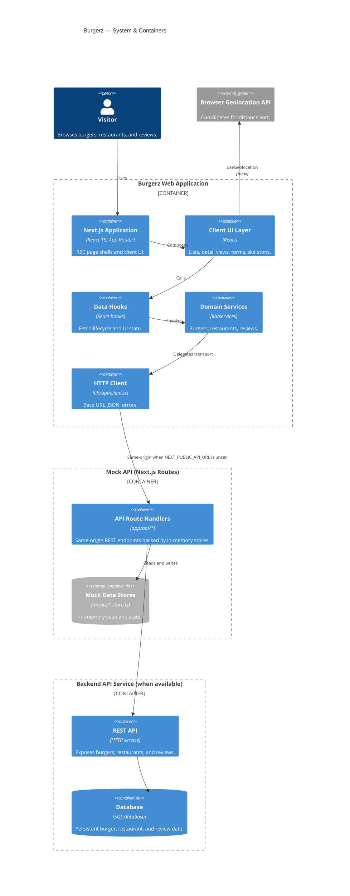

```mermaid
C4Container
    title Burgerz — System & Containers

    UpdateLayoutConfig($c4ShapeInRow="2", $c4BoundaryInRow="1")

    Person(visitor, "Visitor", "Browses burgers, restaurants, and reviews.")

    System_Ext(geolocation, "Browser Geolocation API", "Coordinates for distance sort.")

    Container_Boundary(burgerz, "Burgerz Web Application") {
        Container(nextApp, "Next.js Application", "React 19, App Router", "RSC page shells and client UI.")
        Container(clientUI, "Client UI Layer", "React", "Lists, detail views, forms, skeletons.")
        Container(hooks, "Data Hooks", "React hooks", "Fetch lifecycle and UI state.")
        Container(services, "Domain Services", "lib/services", "Burgers, restaurants, reviews.")
        Container(apiClient, "HTTP Client", "lib/api/client.ts", "Base URL, JSON, errors.")
    }

    Container_Boundary(mockApi, "Mock API (Next.js Routes)") {
        Container(apiRoutes, "API Route Handlers", "app/api/*", "Same-origin REST endpoints backed by in-memory stores.")
        ContainerDb_Ext(mockStores, "Mock Data Stores", "mocks/*-store.ts", "In-memory seed and state.")
    }

    Container_Boundary(backend, "Backend API Service (when available)") {
        Container(apiService, "REST API", "HTTP service", "Exposes burgers, restaurants, and reviews.")
        ContainerDb(database, "Database", "SQL database", "Persistent burger, restaurant, and review data.")
    }

    Rel_L(clientUI, geolocation, "useGeolocation", "Hook")
    Rel_L(visitor, nextApp, "Uses")

    Rel_R(nextApp, clientUI, "Composes")
    Rel_D(clientUI, hooks, "Calls")
    Rel_R(hooks, services, "Invokes")
    Rel_D(services, apiClient, "Delegates transport")

    Rel_R(apiRoutes, mockStores, "Reads and writes")
    Rel_D(apiClient, apiRoutes, "Same-origin when NEXT_PUBLIC_API_URL is unset")

    Rel_R(apiService, database, "")
    Rel_D(apiRoutes, apiService, "")

    UpdateRelStyle(clientUI, hooks, $offsetX="-15")
    UpdateRelStyle(services, apiClient, $offsetX="-15")
    UpdateRelStyle(apiClient, apiRoutes, $offsetX="-20")
    UpdateRelStyle(apiClient, apiService, $offsetX="20")
    UpdateRelStyle(clientUI, geolocation, $offsetX="-35", $offsetY="-5")
```
